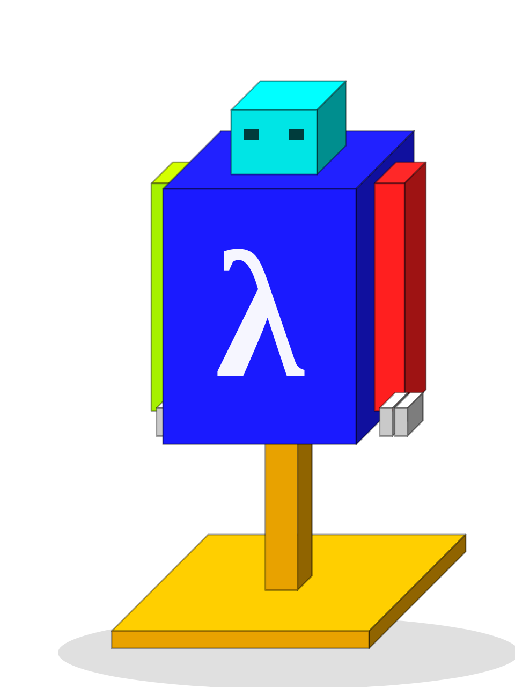
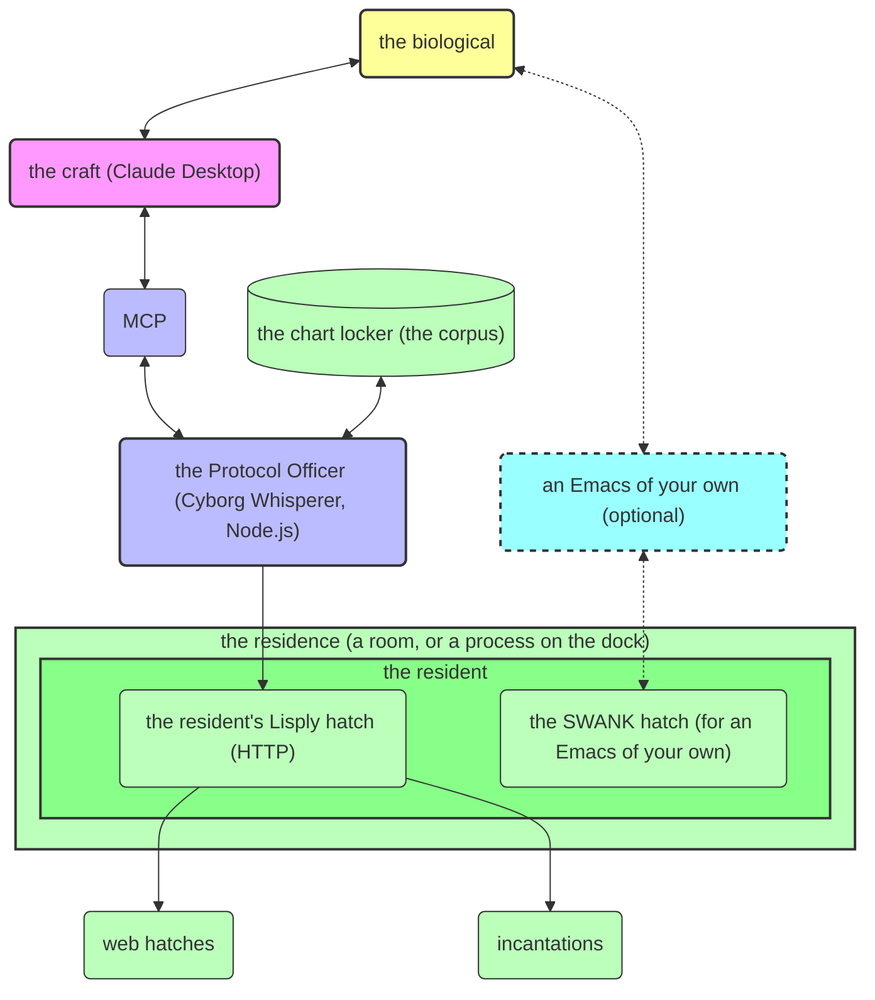

<!--
Copyright © 2026 Gornskew Enterprises

This program is free software: you can redistribute it and/or modify
it under the terms of the GNU Affero General Public License as
published by the Free Software Foundation, either version 3 of the
License, or (at your option) any later version.  Distributed WITHOUT
ANY WARRANTY; see <https://www.gnu.org/licenses/agpl-3.0.html>.
-->

> [!IMPORTANT]
> **Looking for lisply-mcp?**  The plain-language "corporate" fork
> lives at [genworks/lisply-mcp](https://github.com/genworks/lisply-mcp).
>
> This repository (`cyborg-whisperer`) is the gaming-language upstream
> and is maintained separately.  A clone whose `origin` still points at
> `gornskew/lisply-mcp` lands here; to follow the fork instead:
>
> ```bash
> git remote set-url origin https://github.com/genworks/lisply-mcp.git
> ```

# Cyborg Whisperer: a Protocol Officer for Lisp-Speaking Crews



Aboard a [Basilisk](https://github.com/gornskew/basilisk)-class
vessel, no cyborg wanders. Every visit — however it beams aboard — is
bound for a particular crew member, and every visit begins the same
way: with the **Protocol Officer**. He receives each arriving cyborg,
interviews it, schools it in the ship's ways, and dispatches it to
the crew member it came to see.

Cyborg Whisperer is the kit for that post — the species, if you like,
of which every Protocol Officer is a member. Post one beside any crew
member who answers the _Lisply_ dialect, aboard ship or ashore, and
arriving cyborgs find themselves received, educated, and set to
useful work.

Plainly: this is the middleware that speaks
[MCP](https://modelcontextprotocol.org) — the Muster-and-Conduct
Protocol, in which an Officer musters each arriving cyborg and
conducts it to its crew member — to the [large language
models](https://en.wikipedia.org/wiki/Large_language_model) that are
the cyborgs, and a lightweight dialect called _Lisply_ to the
[Lisp](https://common-lisp.net/) residents that are the crew.

**Note: the Officer raises no residence.** He is a caller at a hatch
that is already open — a pure HTTP client (HTTP being the
Hatch-To-hatch Transfer Protocol, a plain hail from one hatch to
another) to a resident already answering. Raising rooms is the vat's
business, through the Basilisk yard — see "Running it" in the
[Basilisk README](https://github.com/gornskew/basilisk) — or open a
Lisply hatch of your own on the dock and point the Officer at it.
Once a resident answers, Claude Desktop calls on him as the example
registries below show.

## Who Is this Meant For?

 - AI practitioners curious about Lisp
 - Lisp practitioners curious about AI
 - Anyone interested in Neuro-Symbolic Programming
 - Mechanical/Civil Engineers and Designers interested in CAD
   Automation and Knowledge Based Engineering
 - Tinkerers, meddlers, and tamperers from all walks of life

## What Is it Meant to Do?

The Officer connects the craft a cyborg arrives in — any
[MCP-capable](https://modelcontextprotocol.org) client, such as
[Claude Desktop](https://www.anthropic.com/claude) — to a Lisp
resident who keeps a REPL, a Read-Eval-Print Loop. The connection is
meant for AI-assisted symbolic programming, sometimes called
_Neuro-Symbolic Programming_. We coined "Lisply" for the small
dialect most any Lisp-like resident can learn so as to stand with a
Protocol Officer of his own.

The idea is that the cyborg can compose and have worked arbitrary
Lisp incantations, up to and including writing, compiling, loading
and testing whole scrolls and projects.

## Sandbox Trust Model

Lisply-backed MCP servers are intended to be exposed to the LLM as
**trusted sandboxes**. The wrapper is not designed to restrict Lisp
operators, filesystem access, or subprocess execution inside the
backend environment. Instead, the backend itself is expected to run in
an isolated container or other sandbox chosen by the operator.

This is intentional:

- `lisp_eval` is meant to support free-form, full use by LLMs.
- `/projects` may be a host-mounted working tree, but the rest of the
  backend filesystem may remain container-ephemeral.
- Trust decisions should therefore be made at the container/backend
  boundary, not by crippling Lisp evaluation in the MCP wrapper.

The wrapper now advertises this trust model in tool metadata with a
default `TRUST_AS_SANDBOX=true`. Operators can override the explanatory
text with `SANDBOX_NOTE` if needed.


## Extra Quick Start

Follow "Running it" in the [Basilisk
README](https://github.com/gornskew/basilisk) — `git clone` the yard,
then `./basilisk up`.

This raises a whole ship, with a Protocol Officer already at his post
beside the Captain.


## Quick Start

The following gets you going quickly with a minimal default
registry and the default public Common Lisp resident (the First
Officer, a Gendl room raised from the vat). See the main Contents
below for more background and every flag.

### 1. Install

1. Install Node.js (18+ recommended). If on Windows, this can be
   installed directly in Windows or in WSL.

2. Have a resident with an open hatch to call on. The easiest way is
   a ship raised from the [Basilisk
   yard](https://github.com/gornskew/basilisk) (requires a vat:
   [Docker](https://docs.docker.com/engine/install/)); or open a
   Lisply hatch of your own on the dock.

3. Copy these `cyborg-whisperer` scrolls to somewhere the craft (Claude
   Desktop, say) can reach.
   
 
### 2. Tell the craft where the Officer stands

Edit or create the craft's registry as shown below. For Claude
Desktop, the registry is typically:


```
/mnt/c/Users/<user>/AppData/Roaming/Claude/claude_desktop_config.json
```

or 

```
c:\Users\<user>\AppData\Roaming\Claude\claude_desktop_config.json
```

In the example below, replace `/path/to/cloned/` with the real path
to the `./scripts/mcp-wrapper.js` scroll in your copy. The channel
names are yours to choose; these are the rooms' own, as a Basilisk
ship names them:

```json
{
  "mcpServers": {
    "gendl-ccl": {
      "command": "node",
      "args": [
        "/path/to/cloned/cyborg-whisperer/scripts/mcp-wrapper.js",
        "--server-name", "gendl-ccl",
        "--http-port", "9080"
      ]
    },
    "gendl-sbcl": {
      "command": "node",
      "args": [
        "/path/to/cloned/cyborg-whisperer/scripts/mcp-wrapper.js",
        "--server-name", "gendl-sbcl",
        "--http-port", "9090"
      ]
    },
    "readymax": {
      "command": "node",
      "args": [
        "/path/to/cloned/cyborg-whisperer/scripts/mcp-wrapper.js",
        "--server-name", "readymax",
        "--http-port", "7080"
      ]
    }
  }
}
```


Or in a WSL scenario (where the Claude Desktop is running in the
Windows host):


```json
{
  "mcpServers": {
    "gendl-ccl": {
      "command": "wsl",
      "args": [
        "node", "/path/to/cloned/cyborg-whisperer/scripts/mcp-wrapper.js",
        "--server-name", "gendl-ccl",
        "--http-port", "9080"
      ]
    },
    "gendl-sbcl": {
      "command": "wsl",
      "args": [
        "node", "/path/to/cloned/cyborg-whisperer/scripts/mcp-wrapper.js",
        "--server-name", "gendl-sbcl",
        "--http-port", "9090"
      ]
    },
    "readymax": {
      "command": "wsl",
      "args": [
        "node", "/path/to/cloned/cyborg-whisperer/scripts/mcp-wrapper.js",
        "--server-name", "readymax",
        "--http-port", "7080"
      ]
    }
  }
}
```


See the main Contents below for the other flags, for example how to
name a resident's hatch elsewhere. (Stowing pouches from the dock
aboard a residence is the yard's business — Basilisk's articles — not
the Officer's.)


Each channel stands on its own, so several residents can be worked at
once without their tools colliding.


### 3. Wake the craft afresh, and hail

With the registry in place, the freshly woken craft has a channel
called `bridge`, with a `bridge__lisp_eval` tool (among the few others
discussed in the main Contents below). Tools carry the channel's name
as a prefix, so several Officers can stand at once without colliding.

To try it, hail the cyborg:

>
> Evaluate `(+ 1 2 3)` using the bridge__lisp_eval tool, and let me know the
> result.
>

The cyborg should have the incantation worked and answer `6`. Try
more complex incantations before going on.


## How Does the Default Minimal Configuration Work?

The minimal registry of the Quick Start calls on a
[Gendl](https://gitlab.common-lisp.net/gendl/gendl) resident already
answering (aboard a Basilisk ship, say): a Common Lisp superset with a
standard REPL. The Officer himself raises nothing. A second Lisply
hatch, in Emacs Lisp, is kept by the Captain of the
[Readymax](https://github.com/gornskew/readymax/tree/devo/dot-files/emacs.d/sideloaded/lisply-backend)
ready room.


## System Overview

The Officer is a JavaScript program standing on Node.js, a bridge
between the craft and any resident who [answers the Lisply
dialect](BACKEND-REQS.md). Through him a cyborg can:

1. hand the resident an incantation and read back what came of it;
2. hail any web hatch the resident keeps;
3. consult the resident's own lore — introspection, documentation — by
   incantation;
4. write, compile, load and study scrolls, again by incantation.

[Lisply](./BACKEND-REQS.md) is the small dialect: a few hatches (HTTP
paths), a standard set of flags hoisted at raising (environment
variables), and a few optional abilities, so that cyborgs may work a
living Lisp resident.

## Architecture

The drawing below roughly shows who stands where:




The Officer:
1. turns a tool call in MCP into a hail at the resident's [Lisply
   hatch](BACKEND-REQS.md), and the answer back into a tool result
2. keeps the smoke (his log), and reports what went wrong

## Security Considerations

Because the Officer lets arbitrary Lisp be worked in a living
resident, there are risks should the cyborg go "haywire." Best
practice, plainly:

- Let the Officer call only on a resident living in a container. Given
  another host and port, he will happily call at any live
  Lisply-compliant HTTP port -- do not let that be a port served by a
  program running directly on your own machine.

- Mount nothing you cannot afford to lose into that container (what is
  mounted is the yard's business -- the compose setup -- not the
  Officer's).

- Consider [limiting the RAM and CPU](https://docs.docker.com/engine/containers/resource_constraints/)
  of the container.
  

### The scrolls in this chest

- **lib/config.js**: Configuration loading and environment handling
- **lib/logger.js**: Logging functionality 
- **lib/server.js**: HTTP server and MCP wrapper implementation
- **lib/utils.js**: Utility functions for response handling
- **handlers/**: Tool-specific request handlers
  - **initialize.js**: Initialization handler
  - **toolsList.js**: Tools list handler
  - **toolCall.js**: Main tool call dispatcher
  - **httpRequest.js**: HTTP request handler
  - **ping.js**: Ping handler
  - **lispEval.js**: Lisp evaluation handler
  - **lisply-index.js**: the reference indexer for a Lisply corpus --
    the `lisply_search` index a project builds and ships in its own
    image; the contract is [CORPUS.md](CORPUS.md)
  - **lisplySearch.js**: Document-corpus search handler, the
    `lisply_search` tool (backends that advertise it, e.g. Readymax
    rooms)
- **mcp-wrapper.js**: the Officer himself -- start here


## Posting the Officer by hand

1. Clone this repository:
```bash
git clone https://github.com/gornskew/cyborg-whisperer.git
```

2. Install what he stands on (optional; the Officer fetches it himself when missing):
```bash
cd cyborg-whisperer/scripts
npm install # optional - the script will attempt to do this also if needed
chmod +x mcp-wrapper.js # needed on some systems
```

3. Ask him for his flags:
```bash
node mcp-wrapper.js --help
```

## The Officer's flags

Optional settings, with defaults suitable for most postings:

### Command-Line Arguments

```bash
Options:
  -H, --backend-host <host>            Lisply backend host (default: 127.0.0.1)
  --http-host-port <port>              Backend HTTP port as published on this host; used when
                                       backend host is localhost/loopback (default: 9081)
  --http-port <port>                   Backend HTTP port inside the container network; used for
                                       non-local backend hosts (default: 9080)
  --swank-host-port <port>             SWANK port on host system (documentation/diagnostics) (default: 4201)
  --swank-port <port>                  SWANK port inside container (documentation/diagnostics) (default: 4200)
  --log-file <path>                    Path to log file (default: /tmp/lisply-mcp-wrapper.log)
  --debug                              Enable debug logging
  --endpoint-prefix <prefix>           Prefix for all endpoints (default: lisply)
  --lisp-eval-endpoint <n>             Endpoint name for Lisp evaluation (default: lisp-eval)
  --http-request-endpoint <n>          Endpoint name for HTTP requests (default: http-request)
  --ping-endpoint <n>                  Endpoint name for ping (default: ping-lisp)
  --server-name <name>                 MCP server name for tool prefixing (default: lisply-mcp)
  --eval-timeout <ms>                  Timeout for Lisp evaluation in milliseconds (default: 30000)
  --request-timeout-ms <ms>            Timeout for backend HTTP requests in milliseconds (default: 10000)
  -h, --help                           Display help for command
```

### Environment Variables

The Officer also reads flags hoisted at raising (environment
variables), with the "LISPLY_" prefix or with none:

**Note:** keep straight the difference between a hatch on the dock
(listening on, and reachable from, the host machine) and a hatch
inside the residence (what the resident himself sees):

| Environment Variable | Description | Default |
|----------------------|-------------|---------|
| `BACKEND_HOST` or `LISPLY_BACKEND_HOST` | Lisply backend host | 127.0.0.1 |
| `HTTP_HOST_PORT` or `LISPLY_HTTP_HOST_PORT` | Backend HTTP port as published on this host (loopback backends) | 9081 |
| `HTTP_PORT` or `LISPLY_HTTP_PORT` | Backend HTTP port inside the container network (non-local backends) | 9080 |
| `SWANK_HOST_PORT` or `LISPLY_SWANK_HOST_PORT` | SWANK port on host system (documentation/diagnostics) | 4201 |
| `SWANK_PORT` or `LISPLY_SWANK_PORT` | SWANK port inside container (documentation/diagnostics) | 4200 |
| `LOG_FILE` or `LISPLY_LOG_FILE` | Path to log file | /tmp/lisply-mcp-wrapper.log |
| `DEBUG_MODE` or `LISPLY_DEBUG_MODE` | Enable debug logging | false |
| `EVAL_TIMEOUT` or `LISPLY_EVAL_TIMEOUT` | Timeout for Lisp evaluation in ms | 30000 |
| `REQUEST_TIMEOUT_MS` or `LISPLY_REQUEST_TIMEOUT_MS` | Timeout for backend HTTP requests in ms | 10000 |
| `ENDPOINT_PREFIX` or `LISPLY_ENDPOINT_PREFIX` | Prefix for all endpoints | lisply |
| `LISP_EVAL_ENDPOINT` or `LISPLY_LISP_EVAL_ENDPOINT` | Endpoint name for Lisp evaluation | lisp-eval |
| `HTTP_REQUEST_ENDPOINT` or `LISPLY_HTTP_REQUEST_ENDPOINT` | Endpoint name for HTTP requests | http-request |
| `PING_ENDPOINT` or `LISPLY_PING_ENDPOINT` | Endpoint name for ping | ping-lisp |
| `SERVER_NAME` or `LISPLY_SERVER_NAME` | MCP server name for tool prefixing | lisply-mcp |
| `TRUST_AS_SANDBOX` or `LISPLY_TRUST_AS_SANDBOX` | Advertise backend as an explicitly trusted sandbox in tool metadata | true |
| `SANDBOX_NOTE` or `LISPLY_SANDBOX_NOTE` | Override the sandbox-note text shown in tool metadata | (built-in note) |

## Raising rooms is the vat's business, not the Officer's

Earlier Officers could pull, raise and mind residences themselves
(choosing the casting, stowing pouches, raising on demand, sensing a
room already up). That whole subsystem is in the attic. The Officer is
now a pure caller: he hails whatever resident already answers at the
host and hatch he was given, and says so helpfully (with a hint to
raise the ship) when nobody is home.

For rooms raised from the vat (Gendl, Readymax and the rest), use the
Basilisk yard, `gitlab.genworks.com:gornskew/basilisk` (`./basilisk
up`), whose articles choose the castings, stow the pouches, open the
hatches on the dock and map the uids. For a resident living on the
dock, open the hatch yourself (the space-suit path in readymax
`docs/HOST_EMACS_MCP.md`, say) and point the Officer at it.

## Communication

Two links are involved, and they are easy to conflate:

1. **craft ↔ Officer**: MCP over standard input/output (the standard
   MCP stdio transport). JSON-RPC plumbing the craft manages, nothing
   to do with any resident's REPL.

2. **Officer ↔ resident**: HTTP only. The Officer POSTs at the
   resident's Lisply hatches and returns structured answers.

**What the hatch link is like:**
- Structured responses with separate result, stdout, and error fields
- Errors are trapped by the backend and returned as strings
- Response format: `{Result: <result>, Stdout: <output>, Error: <any error>}`

**Example response:**
```
{"Result": "6", "Stdout": "This is a message to standard output"}
```

An earlier "stdio mode", which spoke to the raw REPL of a residence
the Officer had raised himself (the interactive debugger, output as it
came), went to the attic with the raising. The like may return at the
hatch (a restarts hatch, streamed output) without tying the Officer
to the vat again.

## Usage Examples 

All the examples below can be tried at a shell and used in the
`claude_desktop_config.json` registry (see the Quick Start above).

## A second channel beside the Officer: a filesystem server

Below is a `claude_desktop_config.json` that posts a filesystem MCP
server beside our `lisply-gendl` Officer. (The filesystem server
takes its pouch here; pouches stowed aboard a residence are the
yard's articles, not the Officer's.)


```json
{
  "mcpServers": {
    "filesystem": {
      "command": "wsl",
      "args": [
        "docker",
        "run",
        "-i",
        "--rm",
        "-u",
        "1000:1000",
        "--mount",
        "type=bind,src=/home/user/projects,dst=/projects",
        "mcp/filesystem",
        "/projects"
      ]
    },
    "lisply-gendl": {
      "command": "wsl",
      "args": [
        "node",
        "/home/user/projects/cyborg-whisperer/scripts/mcp-wrapper.js",
        "--server-name", "gendl"
      ]
    }
  },
  "globalShortcut": ""
}
```

### The tools he grants, in detail

#### The incantation (`<channel>__lisp_eval`)

The `lisp_eval` tool (prefixed with the channel name, e.g. `gendl__lisp_eval`)
lets a cyborg hand the resident an incantation to work, with these
parameters:

- `code` (required): The Lisp code to evaluate
- `package` (optional): The package to use for the evaluation

#### The hail (`<channel>__http_request`)

The `http_request` tool (prefixed with the channel name, e.g. `gendl__http_request`)
lets a cyborg reach any web hatch the resident keeps (this example
works against the default Gendl resident, whose `/color-map` hatch is
built in):

```json
{
  "path": "/color-map",
  "method": "GET",
  "headers": {
    "Accept": "application/json"
  }
}
```

#### Is anyone home (`<channel>__ping_lisp`)

The `ping_lisp` tool (prefixed with the channel name, e.g. `gendl__ping_lisp`)
lets a cyborg confirm that the resident answers:

```
<server>__ping_lisp()
```

## A first incantation, worked

### Example 1: a parametric box

Here a cyborg (Claude) has the resident build a parametric box, then
changes it as the biological asks.

**User**: "Can you create a box with width 10, height 5, and depth 3?
Then show me how to change the height to 8."

**Claude**:

I'll create a parametric box using the lisp_eval tool, then show you
how to modify its height.

First, let's create the box with the specified dimensions:

```lisp
(in-package :gdl-user)

;; First, create a box with the specified dimensions
(defparameter *my-box* (make-object 'box 
                         :width 10 
                         :height 5 
                         :length 3))

;; Let's verify the dimensions
(list (theo *my-box* width)
      (theo *my-box* height)
      (theo *my-box* length))
```

Now, let's change the height from 5 to 8:

```lisp
;; Change the height using setf with accessor
(theo *my-box* (set-slot! :height 8))

;; Alternatively, we could create a new box
(defparameter *new-box* (make-object 'box 
                         :width 10 
                         :height 8  ;; Updated height
                         :length 3))

;; Verify the new dimensions of original box
(list (theo *my-box* width)
      (theo *my-box* height)
      (theo *my-box* length))
```

This box can be visualized by creating a web interface or using a
built-in gendl visualization tool such as `geysr`. See [Gendl
Documentation](https://gornschool.com) for details.


## Troubleshooting

### Common Issues and Solutions

#### Nobody home

If the Officer reports he cannot reach the resident:

1. Aboard ship, make sure the ship is raised:
```bash
cd ~/projects/basilisk && ./basilisk up
```

2. Hail the hatch yourself:
```bash
curl http://localhost:9081/lisply/ping-lisp
```

#### The craft cannot get through

If the craft cannot reach the resident it was pointed at:

1. Is the ship raised (aboard ship)?
```bash
docker ps    # every room listed, and healthy
```


2. Read the Officer's smoke:
```bash
tail -f /tmp/lisply-mcp-wrapper.log
```

3. Read the craft's own smoke (Claude Desktop's log) with Windows
   tools, e.g. Notepad. Typically at:

WSL/Linux:
```
/mnt/c/Users/<user>/AppData/Roaming/Claude/logs/mcp-server-lisply.log
```

Windows:
```
c:\Users\<user>\AppData\Roaming\Claude\logs\mcp-server-lisply.log
```


5. Hail the hatch yourself:
```bash
curl http://localhost:9081/lisply/ping-lisp
```

6. Try the SWANK hatch (4201 on the dock by default):
```bash
M-x slime-connect  ;; from emacs
```

A Captain wearing the [Readymax](https://github.com/gornskew/readymax)
scrolls knows `M-x slime-connect` already.

#### Permission surprises

If you meet file-ownership surprises in a pouch stowed aboard a
residence, remember that stowage and uid mapping are the yard's
articles, not the Officer's. Check the pouch's permissions:
```bash
ls -l /path/to/mounted/directory
```

### Reading the smoke

Where to look, in order:

1. The Officer's smoke:
```bash
tail -f /tmp/lisply-mcp-wrapper.log
```

2. The ship's smoke (aboard ship):
```bash
cd ~/projects/basilisk && ./basilisk logs
```

3. The hatch:
```bash
curl http://localhost:9081/lisply/ping-lisp
```

4. The vat:
```bash
docker system info
```

## License

This software is licensed under the GNU Affero General Public License
v3.0 (AGPL-3.0), the same license used by Gendl.

### License Implications

Simply using this MCP server to interact with a Lisply backend and
obtain outputs does not trigger the requirements of the AGPL, e.g. you
can use this wrapper to interact with Gendl without being required to
share your code.

However, if you modify or extend this wrapper, or a license-compatible
Lisply backend such as Gendl, and wish to distribute and/or host a
service based on that result (commercial or not), then the AGPL would
require you to share your modifications with the downstream recipients
or users. 

For applications that need to keep their source code closed, Genworks
has begun offering an "escape clause" from AGPL restrictions for a 5%
self-reported quarterly revenue royalty. More information and a
payment gateway are available at
[genworks.com/royalties](https://genworks.com/royalties).

The full text of the license can be found in the COPYING.txt file in
this directory. 

## Where the Officer is listed

- [MCPHub](https://mcphub.com/mcp-servers/gornskew/lisply-mcp)

